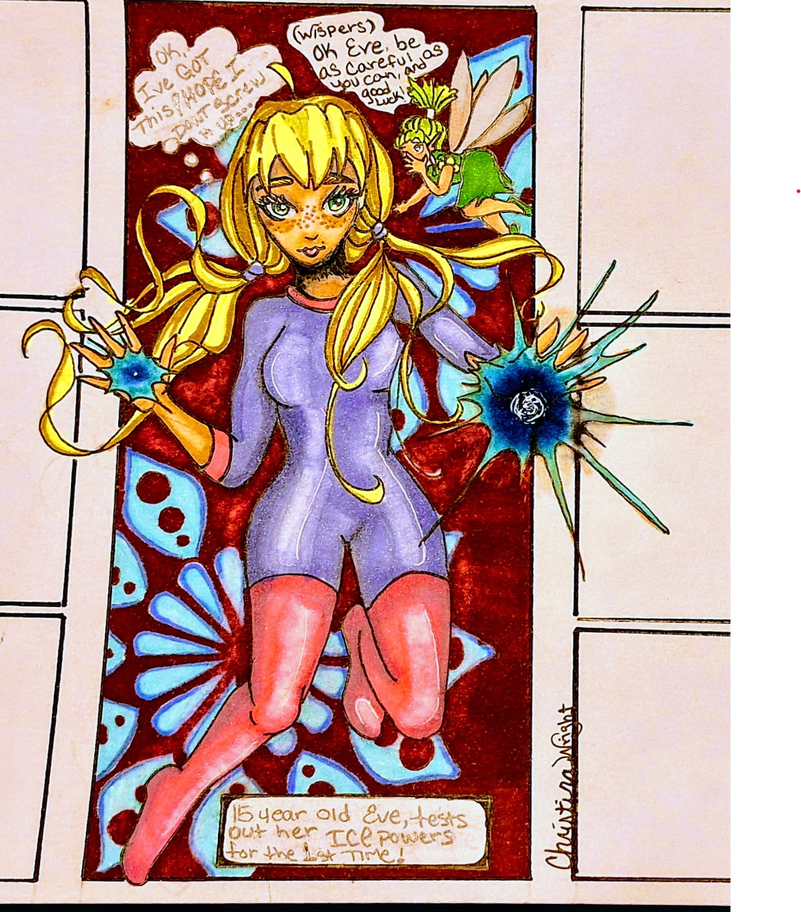

# Christina Wright Portfolio — Comics Page

Upload these files and folders into the root of your GitHub repository.

## Included

- `comics.html`
- `comics.css`
- `comics.js`
- `images/comics/` with all comic page images and background image
- `images/comics-thumbnail.jpg` for the home page carousel thumbnail
- `index-carousel-comics-link-snippet.html` for the correct carousel link

## Home page carousel link

Use this on `index.html` for the Comics carousel card:

```html
<a class="category-slide" href="comics.html">
  
  <div class="slide-overlay"><span>03</span><h3>Comics</h3><p>Comic panels, storytelling, layouts, and sequential art.</p></div>
</a>
```

## Important

Do not rename the files unless you also update the image paths in `comics.html` and `comics.css`.
